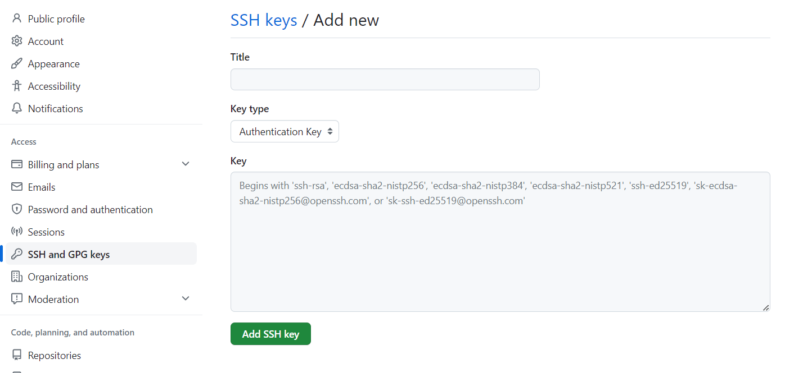
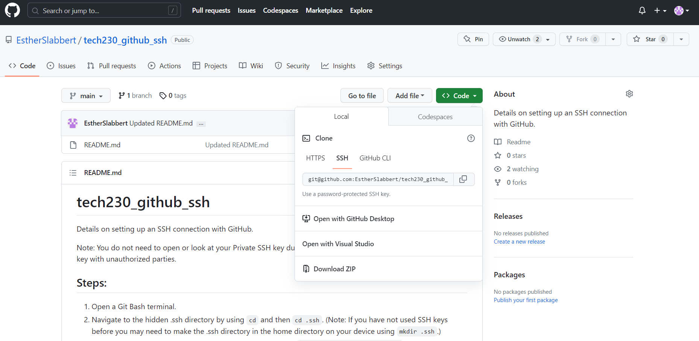

# SSH Authentication GitHub

Details on setting up an SSH connection with GitHub.

Note: You do not need to open or look at your Private SSH key during this process. You should not share your private key with unauthorized parties.

## Steps:

1. Open a Git Bash terminal.
2. Navigate to the hidden .ssh directory by using `cd` and then `cd .ssh`. (Note: If you have not used SSH keys before you may need to make the .ssh directory in the home directory on your device using `mkdir .ssh`.)
3. To create an SSH key (both the public and private keys) enter: `ssh-keygen -t rsa -b 4096 -C "git_hub_email_address@gmail.com"` (Note: `-b 4096` is a standard size for SSH key and the email should be the one linked to your GitHub account). Follow the instructions in the terminal.
This should return something similar to the following:
```
Generating public/private rsa key pair.
Enter file in which to save the key (/c/Users/Name/.ssh/id_rsa):
```
Follow the instructions and name the file for the SSH key and enter. (In this case I will use: 'name_chosen_for_github_ssh').
```
Enter passphrase (empty for no passphrase):
Enter same passphrase again:
```
Follow the instructions to add a passphrase to your SSH if you want one or hit `Enter` twice for no passphrase.
It should return similar to the following:
```
Your identification has been saved in name_chosen_for_github_ssh
Your public key has been saved in name_chosen_for_github_ssh.pub
The key fingerprint is:
SHA258:OY9ZBRd+psw5QOYdDTEPS0nNaFvj3ytTtyhUP0mqZG0 git_hub_email_address@gmail.com
The key's randomart image is:
+---[RSA 4096]----+
|          +.@X   |
|         + *+**  |
|          o.=++. |
|         . =.*.. |
|        S . O +.o|
|         * + E =+|
|        o = o o =|
|           o + o |
|            . o  |
+----[SHA258]-----+
```

4. Enter `cat esther_github_ssh_test.pub` to get the public SSH key that you will copy over to GitHub. It should return something similar to the following:
```
ssh-rsa AAAAB3NzaC1yc2EAAAADAQABAAACAQC9vgB2GPfuitNa29+Xn9Avf4rxf+OIiXNFetxxHoVQcz3/CGacquClOfLz8Qs7U3SGCSjSrwrtDHE81lWIVNPpPcYGsJubyxnM1McbPwrB2OrDwOO43tYFNqm4pNk6eIkDGwA3OFLykDALcmrmdCD3UwMvzKhgxLejZx7IeDyOrkxM6zcygQ2Dv9Jpp6uQb7sDwHVjicGQvGuttjuLXeXvvfIzCnuqfYTryAGV4tTIl8iGNDUgx3EuLpoQhXZSppePvk0oGmvU6/sUrl9UKamIlJn7xL4RVE9Tt9OQsW3ecjTHlIXem/QeEusZpsXD5GfsOxkcu5I5g6m6lg4LJHwQ6oDXAgpjYLMTBulxJKU0ZQmdpBWUxGI8fDOHUmaenXdLOt/77cdAdEwpHYdcuaws6gv/MJH5+oqhd6SwvzUEIgbcg7qif7lCHo6ephhhOSEOx2PSDyB6l/jFUjmMwv8Qe7EKUSCAuSKiZq00pSSYkDsLs9hgt1xhEOHFbOblM7osVX+s/k3+/XX/4PS3yyRsfwz3RmH7QsWx+odVIlCKAOe0T6m1EOCsXMxGoqyLgPcWYwMNtoSPhOWyLMl/o0wvJl8kGTxULUrJ+WHs1kqycoz2Qj8H/Gvfk4tdyfMiW4UebNrfDNwl9z1SOeFkcMDfbL4jVNiLrUSJ9Ghzq16yAQ== git_hub_email_address@gmail.com
```
5. Open GitHub in your browser and login.
6. Navigate to 'Settings' and in the 'Access' section open 'SSH and GPG keys', then select the option 'New SSH key'.



7. Enter the name of your SSH key (eg. 'name_chosen_for_github_ssh') in the 'Title' section. Ensure the 'Key type' is 'Authentication Key'.
8. Copy the results from step 4, ensuring there are no added whitespaces, and paste them in the 'Key' section.
9.  Click the 'Add SSH' button.
10. GitHub will ask you to enter your GitHub password to confirm, so do that. You should be able to see the added SSH key in your 'Settings' in 'SSH and GPG keys' under 'Authentication Keys'.
11. In your Git Bash terminal enter `ssh -T git@github.com`.
<!-- 
The first time you run this It should return similar to the following:
```
The authenticity of host 'github.com (140.82.121.4)' can't be established.
ED25519 key fingerprint is SHA256:+DiY3wvvV6TuJJhbpZisF/zLDA0zPMSvHdkr4UvCOqU.
This key is not known by any other names.
Are you sure you want to continue connecting (yes/no/[fingerprint])?
```
Follow the instructions and enter 'yes'. 
-->
This should return something similar:
```
Warning: Permanently added 'github.com' (ED25519) to the list of known hosts.
git@github.com: Permission denied (publickey).
```
12.  Enter `ssh-agent -s`. It should return similar:
```
SSH_AUTH_SOCK=/tmp/ssh-S7lbFKO1nLBi/agent.1971; export SSH_AUTH_SOCK;
SSH_AGENT_PID=1972; export SSH_AGENT_PID;
echo Agent pid 1972;
```
13.  Enter `ssh-add ~/.ssh/esther_github_ssh_test`. If successful it should return similar to the following:
`Identity added: /c/Users/Name/.ssh/name_chosen_for_github_ssh (git_hub_email_address@gmail.com)`

(Note: If it returns `Could not open a connection to your authentication agent.` run `chmod 644 name_chosen_for_github_ssh` and then `eval ssh-agent -s`, which should return similar `Agent pid 1989`)

14. Enter `ssh -T git@github.com`. If successful it should return similar to the following:
`Hi GitHubName! You've successfully authenticated, but GitHub does not provide shell access.`

15.  Now you can use the SSH authentication when cloning a repository/pulling from GitHub to your local machine or push from your machine to GitHub.

Note:
To clone a repository from GitHub use `git {clone copied_SSH_key}` where you copied the SSH authentication from the repository under 'Code' and 'SSH' rather than 'HTTP' (eg. `git clone git@github.com:EstherSlabbert/tech230_github_ssh.git`)

To push a local repository to GitHub ensure your local git tree is clean then use `git push -u origin main` or `git push` as the SSH connection should already be set up. If you have made changes to the files online you may need to `git pull` before pushing.
